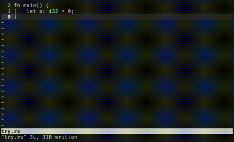

# QFDebug

QFDebug



### How to install

* clone this repo

```
git clone --depth=1 https://github.com/arfanamd/qfdebug.git
```

* copy `qfdebug/plugin/qfdebug.vim` into your `.vim` directory

```
cp -v qfdebug/plugin/qfdebug.vim ~/.vim/plugin/
```

### How to use

This plugin is triggered by executing `:make` command inside Vim.
